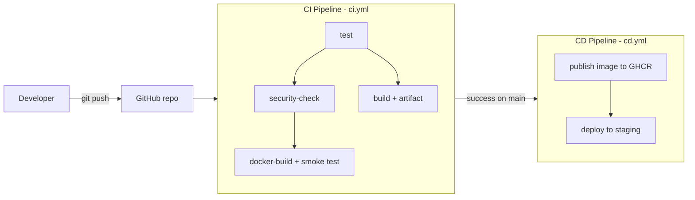

# 11 - Demo Project: Calculator API with CI/CD on GitHub Actions

A small Flask API (`/calc/add?a=2&b=3`) packaged in Docker and shipped by a complete CI/CD pipeline.



## Project layout

```text
11-demo-project/
├── app/                  # application source (calculator.py, main.py = Flask API)
├── tests/                # pytest unit + API tests
├── Dockerfile            # production image (gunicorn, non-root user, healthcheck)
├── build.sh              # creates build/ with the app and build-info.txt
├── requirements*.txt     # runtime / dev dependencies
└── .github/workflows/
    ├── ci.yml            # CI pipeline
    └── cd.yml            # CD pipeline
```

> Like the other session folders, `.github/workflows` lives inside this folder. To run it on GitHub, use this folder as the root of a repository (or copy the workflows to the repo root `.github/workflows/`).

## Concepts and where they appear

| Concept | Where / what it means here |
|---|---|
| **CI vs CD** | CI (`ci.yml`) proves every change is correct: test, build, image smoke test. CD (`cd.yml`) delivers a change that passed CI: publish image, deploy. |
| **CI/CD pipeline** | The two workflows chained with `workflow_run`: CD starts only when CI completes successfully on `main`. |
| **GitHub Actions** | GitHub's built-in automation service; reusable actions are referenced with `uses:` (checkout, setup-python, docker/*, upload/download-artifact). |
| **Workflow** | A YAML file in `.github/workflows/`. Triggered by `on:` events (`push`, `pull_request`, `workflow_run`, `workflow_dispatch`). |
| **Jobs** | Independent units inside a workflow. CI has `test`, `security-check`, `build`, `docker-build`; CD has `publish-image`, `deploy`. `needs:` orders them, unrelated jobs run in parallel. |
| **Steps** | Ordered commands (`run:`) or actions (`uses:`) inside a job, sharing one runner filesystem. |
| **Runners** | The machine that executes a job: `runs-on: ubuntu-latest` is a fresh GitHub-hosted VM per job. |
| **Secrets** | `secrets.GITHUB_TOKEN` (automatic) logs in to GHCR; `secrets.DEPLOY_TOKEN` is an optional environment secret for the `staging` environment. Values are masked in logs. |
| **Artifacts** | CI uploads `test-report` (JUnit XML) and `calculator-build`; CD downloads `calculator-build` from the CI run. |
| **Build** | `build.sh` (artifact) and `docker build` (image). |
| **Test** | `pytest` (11 tests) in the `test` job, plus a container smoke test against `/health` and `/calc/add`. |
| **Pipeline execution** | See "Running it" below. |

## Run locally

```bash
pip install -r requirements.txt -r requirements-dev.txt
pytest -v                          # 11 passed
./build.sh                         # build/ with build-info.txt
docker build -t calculator-api .
docker run -p 5000:5000 calculator-api
curl "localhost:5000/calc/add?a=2&b=3"     # {"a":2.0,"b":3.0,"operation":"add","result":5.0}
```

## Pipelines in detail

### CI (`ci.yml`)
Triggers: push and pull request to `main`, or manually.

1. **test**: checkout, setup Python 3.12, install deps, `pytest --junitxml`, upload `test-report` (even on failure).
2. **security-check** (after test): fails if `.env`, `*.pem` or `*.key` files are committed.
3. **build** (after test): `./build.sh`, upload `calculator-build`.
4. **docker-build** (after test and security-check): build the image, start it, curl the endpoints.

If `test` fails, nothing else runs.

### CD (`cd.yml`)
Triggers: CI completed successfully on `main` (or manual).

1. **publish-image**: log in to `ghcr.io` with `GITHUB_TOKEN`, build and push `ghcr.io/<owner>/<repo>/calculator-api:<sha>` and `:latest`.
2. **deploy** (environment `staging`): download the CI build artifact, print build info, run a simulated deploy using `DEPLOY_TOKEN`. In a real setup this step would run `kubectl`/`helm`/SSH.

### Setup on GitHub
1. Push this folder as a repo's root.
2. Settings > Actions > General: allow workflow permissions "Read and write" for packages.
3. Optional: Settings > Environments > `staging` > add secret `DEPLOY_TOKEN` and required reviewers.

## Running it (pipeline execution)

```bash
git push origin main                 # triggers CI, then CD
```
Open the repo's **Actions** tab: `CI Pipeline` runs first; when it is green, `CD Pipeline` starts automatically. Download the artifacts from the bottom of the CI run summary.

## Screenshots of a successful pipeline run

Add these after pushing (save in a `screenshots/` folder):

| Screenshot | File |
|---|---|
| CI run: all four jobs green | `screenshots/ci-success.png` |
| CI run: Artifacts section (`test-report`, `calculator-build`) | `screenshots/artifacts.png` |
| CD run: publish-image and deploy green | `screenshots/cd-success.png` |
| GHCR package page showing the pushed image | `screenshots/ghcr-package.png` |


## Local verification (before pushing)

```text
$ pytest -v
11 passed in 1.72s

$ docker run -d -p 5055:5000 calculator-api:ci
$ curl localhost:5055/health
{"status":"ok"}
$ curl "localhost:5055/calc/add?a=2&b=3"
{"a":2.0,"b":3.0,"operation":"add","result":5.0}
```
